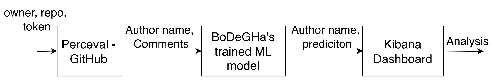
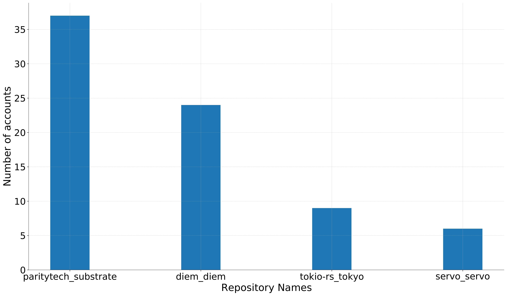
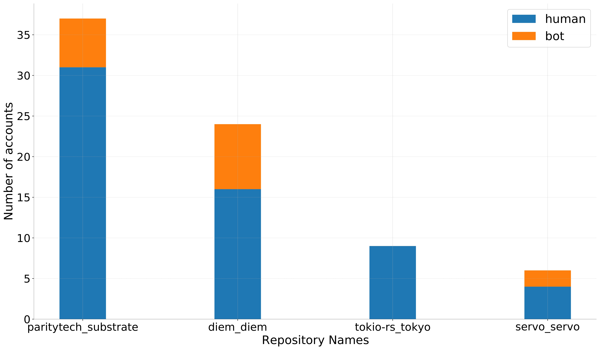

# Bot Detection in GitHub Repositories: Separating Humans from Bots

## Introduction

In today's collaborative software development landscape, GitHub and similar platforms have revolutionized how developers work together. 
However, with this increased collaboration comes a significant workload of repetitive, error-prone, and time-intensive tasks such as:

- Conducting quality checks
- Running automated tests
- Reviewing code
- Merging pull requests
- Building and deploying software

To manage this growing complexity, development teams increasingly rely on bots —machine accounts that operate with minimal human intervention— to automate these tasks. 
As [Erlenhov et al. (2019)](https://ieeexplore.ieee.org/abstract/document/8823643) noted, bots have become essential tools for facing the ever-increasing complexity in software development.

<!-- truncate -->

## The Challenge of Bot Identification

Despite their prevalence, many bot accounts aren't easily identifiable. Consider these examples:

- The **highfive** account greets and assigns issues to contributors in the servo/servo repository but isn't explicitly labeled as a bot
- The **bors-diem** bot manages PR merging in the diem/diem package without "bot" in its name
- Many bots have ordinary GitHub usernames with no indication in their profile description

This identification challenge creates problems for:

1. **Researchers** trying to analyze human collaboration patterns in the presence of bots
2. **Project managers** attempting to assess the impact of bots on development
3. **Organizations** wanting to properly credit human contributors
4. **Analysts** calculating "bus factors" and identifying key project contributors

## The Integration Project

This project aims to solve this problem by integrating [BoDeGHa](https://www.sciencedirect.com/science/article/abs/pii/S016412122100008X), 
a machine learning-based bot detection tool, with the [GrimoireLab](https://chaoss.github.io/grimoirelab/) software development analytics platform. 
GrimoireLab already provides excellent capabilities for:

- Data retrieval through Perceval and Graal
- Data enrichment via HatStall and SortingHat
- Data visualization using Kidash and KiBiter

Adding BoDeGHa's trained ML classifier as a data enrichment component creates a complete end-to-end pipeline for analyzing bot vs. human contributions.

## How The Pipeline Works



The integration works through the following steps:

1. **Data Collection**: Perceval queries the GitHub API with repository details and authentication token to extract issues, PRs, and their associated comments

2. **Data Processing**: The system extracts relevant fields:
    - Issue/PR number
    - Comment text
    - Creation timestamp
    - Author names

3. **Bot Classification**: BoDeGHa's machine learning model analyzes comment patterns to identify bots:
    - Repetitive comment structures
    - Timing patterns
    - Content signatures characteristic of automated responses

4. **Results Storage**: Contributor names and their classification (bot or human) are stored in a structured format

5. **Visualization**: Kibana dashboards transform the data into visual insights about contributor types and activities

## Testing the Integration

To demonstrate this pipeline, we analyzed four popular Cargo package repositories:



- **paritytech/substrate**
- **servo/servo**
- **diem/diem**
- **tokio-rs/tokio**

These repositories were selected due to their size and popularity, making them likely candidates for bot usage in their development processes.

### Results

The analysis period covered December 2021 through January 2022, examining contributors who actively posted comments during this timeframe.



Our findings revealed significant bot presence:
- **paritytech/substrate**: 6 out of 37 contributors (16.2%) were bots
- **diem/diem**: 8 out of 24 contributors (33.3%) were bots
- **servo/servo**: 2 out of 6 contributors (33.3%) were bots
- **tokio-rs/tokio**: All contributors were human

The relatively high proportion of bot contributors (approaching one-third in some repositories) highlights the importance of distinguishing between human and automated activity when analyzing project contributions.

## Potential Extensions and Applications

This integration opens up several valuable possibilities:

### Advanced Visualizations

- **Contribution Volume Analysis**: Charts showing the proportion of comments/PRs handled by bots vs. humans
- **Bot Activity Patterns**: Visualizations of when and how bots are most active in repositories
- **Cross-Repository Bot Usage**: Analysis of which bots are used across multiple projects

### Enhanced Classification

- **User Interface for Corrections**: A mechanism for users to rectify occasional misclassifications
- **Classification Confidence**: Indicators showing the ML model's confidence in each bot/human prediction
- **Custom Training**: Ability to train the model on specific repositories for improved accuracy

### Integration with Existing Tools

- **SortingHat Connection**: Linking to GrimoireLab's contributor management component to maintain bot flags
- **Kibiter Display**: Enhanced data visualization showing bot status in contributor profiles

## Practical Applications

This bot detection capability enables several practical applications:

1. **True Bus Factor Calculation**: Accurately assess project risk by counting only human contributors
2. **Human Contribution Metrics**: Generate reports that highlight the work done by human team members
3. **Bot Performance Analysis**: Evaluate how effectively different bots are serving their intended purposes
4. **Community Growth Tracking**: Monitor genuine human community growth around open-source projects

## Conclusion

As bots become more prevalent in collaborative software development, the ability to distinguish between human and automated contributions grows increasingly important. The integration of BoDeGHa's machine learning classifier into the GrimoireLab pipeline provides a powerful tool for researchers and practitioners seeking to understand the complex dynamics of modern software development teams.

By accurately identifying bot accounts based on their commenting activities in issues and pull requests, this integration enables more nuanced and accurate socio-technical analysis of software repositories. For organizations and project maintainers, it offers a clearer picture of human contributions, facilitating proper recognition and credit allocation.

---

*This is an expanded summary of the research paper "Bot Detection in GitHub Repositories" by Natarajan Chidambaram and Pooya Rostami Mazrae, presented at the 19th International Conference on Mining Software Repositories (MSR '22).*

To check the paper click on following [link](https://dl.acm.org/doi/10.1145/3524842.3528520) or download directly from following [link](../static/papers/MSR_hackathon_2022_BotDetectionInGitHubRepository.pdf) 
and for the implementation you can check the [GitHub repository](https://github.com/pooya-rostami/Hackathon-21).

Citation:
```
@inproceedings{chidambaram2022bot,
  title={Bot detection in github repositories},
  author={Chidambaram, Natarajan and Mazrae, Pooya Rostami},
  booktitle={Proceedings of the 19th International Conference on Mining Software Repositories},
  pages={726--728},
  year={2022}
}
```