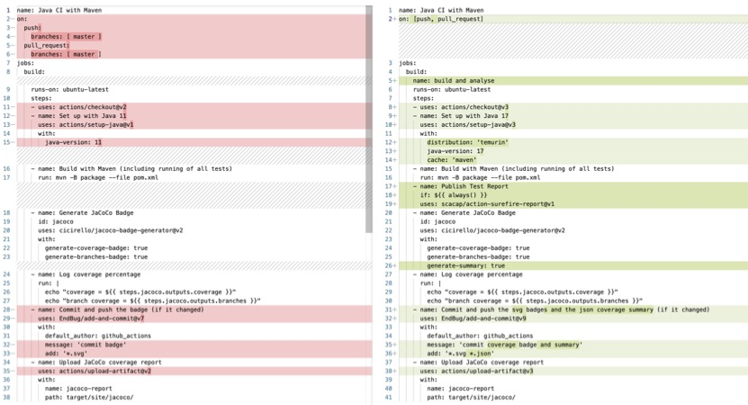

# A Study of GitHub Actions Workflow Changes

## Introduction

Continuous Integration and Development (CI/CD) practices have become essential in modern software development, helping developers release high-quality software more efficiently. GitHub Actions (GHA) was introduced in November 2019 as GitHub's native CI/CD solution and quickly gained popularity, replacing other tools like Travis CI within just 18 months.

This article examines how GitHub Actions workflows evolve over time, based on a study of 22,733 GitHub repositories containing 4 million weekly snapshots of workflow files from November 2019 to September 2022. The research analyzes both coarse-grained changes (adding, modifying, renaming, or removing workflow files) and fine-grained changes (examining line-level modifications within these files).

<!-- truncate -->

## Background on GitHub Actions

GitHub Actions allows developers to automate various aspects of the software development lifecycle. Workflows are configured using YAML files stored in the `.github/workflows/` directory of a repository. These workflows can automate tasks like testing, building, quality checking, dependency management, and security scanning.

As with any software component, workflow files evolve over time to better serve their purposes. Understanding how workflows change can help improve CI/CD practices and assist developers in maintaining their workflows more effectively.

## Example of Workflow Changes

Consider a workflow file for a Java project that evolves over time. Changes might include:

1. Updating the triggers that activate the workflow
2. Adding new steps or modifying existing ones
3. Updating versions of actions being used
4. Changing configuration parameters
5. Renaming steps for clarity



These changes demonstrate how workflows evolve to accommodate new requirements, fix issues, or adopt best practices.

## Research Methodology

The study analyzed 22,733 GitHub repositories with at least 100 stars and 100 commits, created before 2022 and still active in 2022. For each repository, weekly snapshots of workflow files were collected between November 2019 and September 2022, resulting in 4,127,760 workflow file snapshots across 148 time points.


The figure shows continuous growth in both the number of repositories using GitHub Actions and the number of workflow files over the study period, with a notable increase in November-December 2020 when Travis CI imposed restrictions on its free plan.

## When Do Repositories Start Using GitHub Actions?

The study distinguished between repositories that existed before GHA was introduced and those created after. For repositories created after GHA's release:
- 50% adopted GHA within 3 months of creation
- 75% adopted GHA within 10 months

For repositories that existed before GHA's release:
- Only 15% adopted GHA within 3 months of its release
- 50% adopted GHA within 10 months
- 75% adopted GHA within 21 months


This suggests that repositories created after GHA's introduction adopt it quickly, while older repositories take longer to migrate, likely due to existing CI/CD setups and migration challenges.

## Types of Coarse-Grained Changes in Workflows

The study identified four types of coarse-grained changes:
1. **Addition**: The first appearance of a workflow file
2. **Modification**: Changes to the content of an existing workflow file
3. **Removal**: Deletion of a workflow file
4. **Renaming**: Changing the name of a workflow file

The most frequent change type is modification (73% of all changes), followed by addition (22.8%), removal (3.9%), and renaming (0.1%).


On average each week:
- 7.2% of repositories modify a workflow file
- 1.4% add a new workflow file
- 0.5% remove a workflow file

## When Do Coarse-Grained Changes Occur?

Changes to workflow files are more frequent during the initial weeks after adopting GitHub Actions. In the first week after adoption, more than 15% of repositories make changes to their workflows, but this decreases to around 6% after six weeks.


This pattern follows Lehman's software evolution laws of continuing change and continuing growth. While the frequency of changes decreases over time, repositories continue to modify workflows throughout their lifecycle.

## Fine-Grained Changes to Workflow Files

The study also analyzed line-based changes within workflow files, finding that the vast majority (87.8%) of changes involve lines of code rather than blank lines or comments. In fact, 97.6% of all modifications include at least some code changes.

Looking at the nature of line-based changes:
- 78.7% of changes include modifying existing lines
- 50.1% include adding new lines
- 26.2% include removing lines


Only 3.45% of changes involve exclusively removing lines, while 40.11% involve only modifying lines.

## When Do Fine-Grained Changes Occur?

On average, about 10% of lines in workflow files are touched (added, removed, or modified) when changes occur. This proportion is higher during the first few weeks after adopting GitHub Actions.


For line additions, the number decreases over time:
- Average of 7.4 lines added during the first six weeks
- Average of 5.6 lines added during the remainder of the first year


For line modifications, the pattern remains relatively stable:
- Average of 2.8 lines modified during the first six weeks
- Average of 3.1 lines modified during the remainder of the first year


These findings suggest that workflow files are continuously evolving, with more substantial changes occurring early in their lifecycle, followed by regular but smaller maintenance changes.

## Conclusion

This study reveals several key insights about GitHub Actions workflow evolution:

1. **Adoption patterns**: New repositories quickly adopt GitHub Actions, while existing repositories take longer to migrate from other CI/CD systems.

2. **Change frequency**: Workflows undergo frequent changes, particularly during their early lifecycle, with modifications being the most common type of change.

3. **Evolution patterns**: Workflow files follow Lehman's software evolution laws of continuing change and continuing growth, suggesting they evolve similarly to other software artifacts.

4. **Line-level changes**: Most changes involve modifying or adding lines of code, with an average of 3.1 lines modified and 5.8 lines added per workflow change.

These findings provide valuable insights for developers and researchers interested in CI/CD practices and workflow automation. The study lays groundwork for future research into workflow quality, complexity, and maintenance practices.

To check the paper click on following [link](https://ceur-ws.org/Vol-3483/paper8.pdf) or download directly from following [link](../static/papers/Sattose_2023_A%20Preliminary%20Study%20of%20GitHub%20Actions%20Workflow%20Changes.pdf).

Citation:
```
@article{mazrae2023preliminary,
  title={A preliminary study of github actions workflow changes},
  author={Mazrae, P Rostami and Decan, Alexandre and Mens, Tom and Wessel, Mairieli},
  year={2023},
  publisher={Sl: CEUR}
}
```